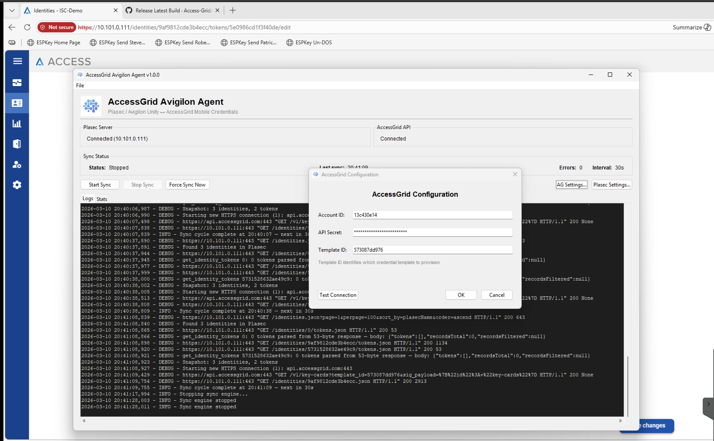

# AccessGrid Avigilon Agent

Sync engine and desktop GUI that bridges **Plasec / Avigilon Unity** access control with **AccessGrid** mobile credentials.



## What it does

The agent runs on a machine with network access to both the Avigilon Unity (Plasec) server and the AccessGrid API. It performs a continuous 6-phase sync cycle:

| Phase | Direction | Description |
|-------|-----------|-------------|
| 1 | Plasec → AG | Provision new mobile credentials for active tokens marked `AccessGrid` |
| 2 | Plasec → AG | Push token status changes (active/inactive/expired) |
| 3 | Plasec → AG | Terminate AG cards when identities or tokens are deleted |
| 4 | AG → Plasec | Sync AccessGrid state changes back to Plasec tokens |
| 5 | — | Retry previously failed syncs |
| 6 | Plasec → AG | Push contact field changes (name, email, phone) |

Only tokens with **Embossed Number = "AccessGrid"** are synced. Tokens whose embossed number changes away from "AccessGrid" are automatically terminated.

## Token filtering

In Avigilon Unity, set the token's **Embossed Number** field to `AccessGrid` to mark it for mobile credential provisioning. Tokens without this marker are ignored.

## Card format & provisioning

For **DESFire / SmartTap** templates, the agent sends the Plasec card format's `site_code` (facility code) and `card_number` to AccessGrid during provisioning. **SEOS** templates provision by cardholder info only — no card data is sent.

The card format is selected during Plasec configuration — after a successful test connection, the available card formats are loaded and the operator picks which one to use.

## Download

Pre-built executables for Windows and macOS are available on the [Releases](https://github.com/Access-Grid/avigilon-service/releases) page. Download the latest release for your platform — no Python installation required.

## Setup (from source)

### Prerequisites

- Python 3.10+
- Network access to the Plasec/Avigilon Unity server (HTTPS)
- An AccessGrid account with API credentials and a card template

### Install

```bash
git clone https://github.com/Access-Grid/avigilon-service.git
cd avigilon-service
python -m venv .venv
source .venv/bin/activate   # Windows: .venv\Scripts\activate
pip install -r requirements.txt
```

### Run

```bash
python -m src.main
```

### Configure

1. Click **Plasec Settings** — enter the Avigilon Unity server IP, username, and password
2. Click **Test Connection** — on success, available card formats are loaded; select the one to use
3. Click **AG Settings** — enter your AccessGrid Account ID, API Secret, and Template ID
4. Click **Test Connection** on AG settings to verify
5. Click **Start Sync**

Configuration is encrypted at rest using Fernet (AES-128-CBC + HMAC-SHA256) and stored in:

| Platform | Path |
|----------|------|
| Windows | `%LOCALAPPDATA%\AccessGridAvigilonAgent\config.json` |
| macOS | `~/Library/Application Support/AccessGridAvigilonAgent/config.json` |
| Linux | `~/.config/accessgrid-avigilon-agent/config.json` |

## Building

Package as a standalone executable with PyInstaller:

```bash
pyinstaller AccessGridAgent.spec
```

The output is in `dist/`.

## Testing

```bash
pip install -r requirements-test.txt
pytest tests/ -v
```

## Project structure

```
src/
  api/client.py        Plasec/Avigilon Unity HTTP client
  sync/engine.py       Sync loop orchestration
  sync/strategies.py   6-phase sync logic
  sync/local_db.py     SQLite sync state tracking
  gui/app.py           Tkinter desktop GUI
  config.py            Encrypted config management
  constants.py         Status codes, mappings, settings
```

## License

Proprietary. Copyright AccessGrid, Inc.
